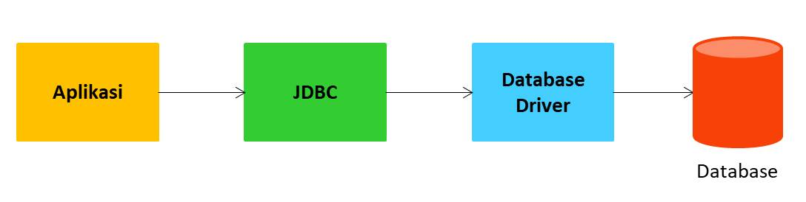

# 10th Path Learning Java : Java Database

# Agenda

- Pengenalan JDBC
- Driver
- Data Source
- Connection
- JDBC Data Type
- Statement
- ResultSet
- Prepared Statement
- SQL Injection
- Metadata
- dan lain-lain

# Pengenalan JDBC

- JDBC adalah singkata dari Java Database Connectivity
- JDBC merupakan spesifikasi API standard untuk mengakses database di Java
- JDBC tidak bisa langsung digunakan, karena isinya hanyalah interface-interface kontrak untuk berinteraksi dengan database
- JDBC perlu implementasi, atau kita sebut dengan Driver, seperti MySQL Driver, PostgreSQL Driver, OracleDB Driver, dan lain-lain
- Semua interface API JDBC terdapat di package java.sql dan javax.sql

# Cara Kerja JDBC

- Aplikasi kita konek ke JDBC
- JDBC ini akan menggunakan Driver untuk konek ke Database

  

# MySQL

- Pada materi kali ini kita akan menggunakan MySQL sebagai database

# Membuat Project

- Kita akan menggunakan Apache Maven untuk membuat project
- Kita bisa menggunakan perintah:
  - `mvn archetype:generate`
  - lalu cari template: `maven-archetype-quickstart`
